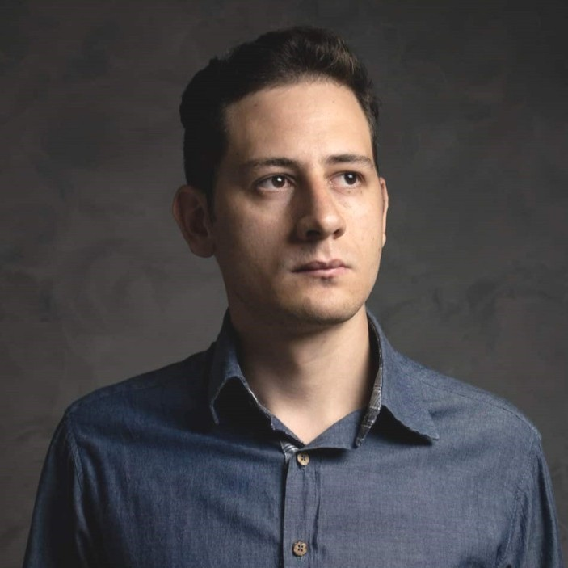
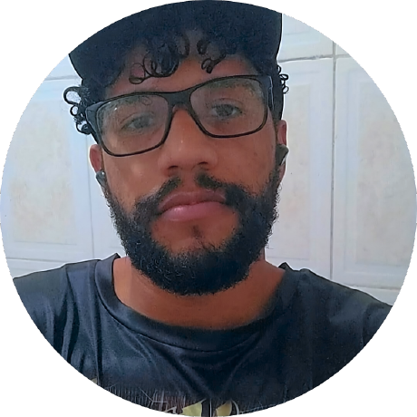
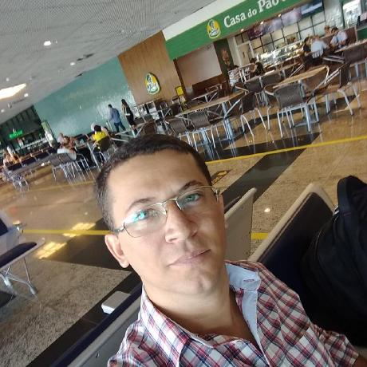
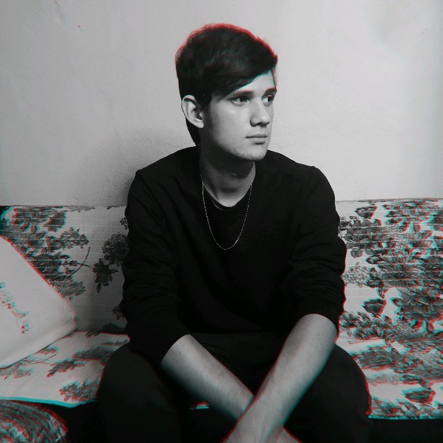
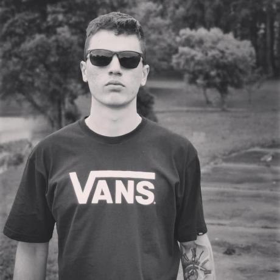
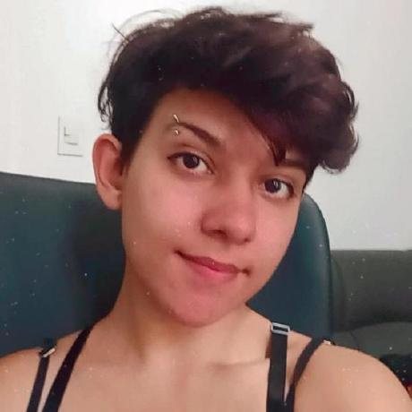
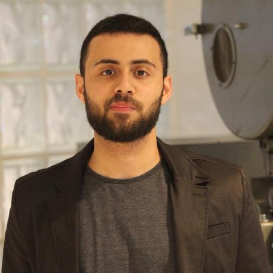
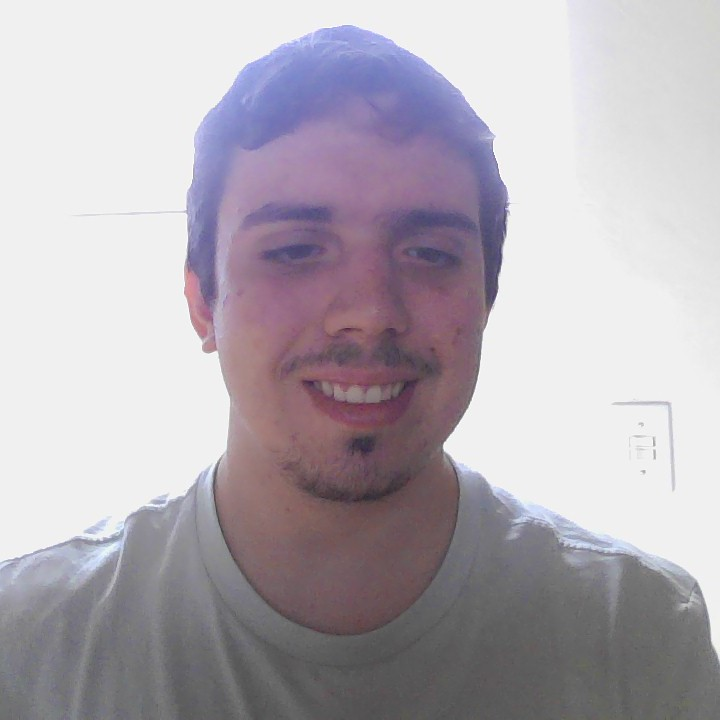

# Natuza Conectada

 
 

 
 
 

Natureza conectada é um aplicativo, que tem o objetivo em ajudar na preservação do meio-ambiente nas cidades, incentivando o plantio de árvores e/ou plantas nativas da região. Juntamente com as intituições públicas e privadas, para poder alavancar o poder deste projeto com ajudas financeiras para as pessoas que o aderirem.

## Como acessar os arquivos

Você pode visualizar os arquivos baixando eles pelo git hub, ou acessando pelos links:

[Apresentação](https://www.canva.com/design/DAF4T7UVSyg/B21qvwGNrSuWYRYbGL-Tsg/edit?utm_content=DAF4T7UVSyg&utm_campaign=designshare&utm_medium=link2&utm_source=sharebutton)
[Relatório]()

## Integrantes

Thales Salla

Welton Santos

Janier Freitas

Carlos Henrique

Rafael Camilo

Pedro Antonetti

Luísa dos Santos

Willian Cavalheiro

Diuliano Vargas

